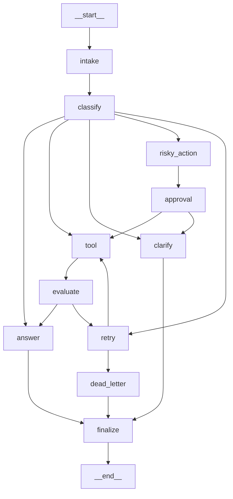

# Day 08 Lab Report — LangGraph Agentic Orchestration
 
## 1. Thông tin sinh viên
 
| Trường | Nội dung |
|---|---|
| **Họ và tên** | Nguyễn Tiến Đạt |
| **Mã sinh viên** | 2A202600217 |
| **Lab** | Phase 2 – Track 3 – Day 08 |
| **Ngày nộp** | 2026-05-11 |
 
---
 
## 2. Kiến trúc hệ thống (Architecture)
 
Agent được xây dựng bằng LangGraph `StateGraph` gồm **11 node** và **4 hàm định tuyến có điều kiện (conditional routing)**. Mọi query đều đi qua pipeline `intake → classify` trước khi được phân phối vào một trong **5 đường xử lý chuyên biệt**.
 
### Sơ đồ luồng
 
```
START → intake → classify ─┬─→ answer                                    → finalize → END  (simple)
                            ├─→ tool → evaluate ─┬─→ answer               → finalize → END  (tool)
                            │                    └─→ retry ─┬─→ tool      (retry loop)
                            │                               └─→ dead_letter → finalize → END
                            ├─→ clarify                                    → finalize → END  (missing_info)
                            ├─→ risky_action → approval → tool → evaluate → answer → finalize → END  (risky)
                            └─→ retry → tool → evaluate → …                                   (error)
```
 
### Mô tả từng node
 
| Node | Trách nhiệm |
|---|---|
| `intake` | Chuẩn hóa query đầu vào (strip/collapse whitespace), ghi audit event |
| `classify` | Phân loại query bằng keyword heuristics theo thứ tự ưu tiên: `risky > tool > missing_info > error > simple` |
| `answer` | Tổng hợp câu trả lời cuối cùng dựa trên kết quả tool / approval |
| `tool` | Thực thi mock tool; mô phỏng lỗi tạm thời để kiểm tra retry loop |
| `evaluate` | Cổng kiểm tra: nếu tool result có lỗi → `needs_retry`, nếu ổn → `success` |
| `clarify` | Đặt câu hỏi làm rõ khi query quá mơ hồ (missing_info path) |
| `risky_action` | Chuẩn bị payload cho HITL, ghi nhận hành động rủi ro và mức độ nguy hiểm |
| `approval` | Xử lý Human-In-The-Loop; mặc định auto-approve trong môi trường CI |
| `retry` | Tăng bộ đếm attempt, ghi metadata backoff |
| `dead_letter` | Ghi nhận các scenario đã hết retry, chuyển sang xử lý thủ công |
| `finalize` | Đóng run, phát summary audit event |
 
---
 
## 3. State Schema
 
State được thiết kế **lean và serializable** để tương thích với mọi checkpointer backend (memory, SQLite, Postgres).
 
| Field | Reducer | Lý do thiết kế |
|---|---|---|
| `thread_id` | overwrite | Khóa chính cho checkpointer, cố định theo run |
| `scenario_id` | overwrite | Định danh cho grading |
| `query` | overwrite | Chuẩn hóa một lần bởi `intake_node` |
| `route` | overwrite | Quyết định routing hiện tại |
| `risk_level` | overwrite | `low / medium / high`, xác định trong `classify_node` |
| `attempt` | overwrite | Bộ đếm retry tăng đơn điệu |
| `max_attempts` | overwrite | Giới hạn retry theo scenario (default 3) |
| `final_answer` | overwrite | Câu trả lời cuối cùng |
| `pending_question` | overwrite | Câu hỏi làm rõ (path missing_info) |
| `proposed_action` | overwrite | Payload mô tả hành động rủi ro cho HITL |
| `approval` | overwrite | Dict kết quả phê duyệt từ reviewer |
| `evaluation_result` | overwrite | `"success"` hoặc `"needs_retry"` |
| `messages` | **append** (`add`) | Log hội thoại, không bao giờ bị ghi đè |
| `tool_results` | **append** (`add`) | Toàn bộ phản hồi tool, phục vụ audit trail |
| `errors` | **append** (`add`) | Lịch sử lỗi, không bị xóa |
| `events` | **append** (`add`) | Audit log đầy đủ theo thứ tự thời gian |
 
> **Thiết kế quan trọng:** Các field dùng reducer `add` đảm bảo tính **append-only** — LangGraph sẽ ghép danh sách mới vào danh sách cũ thay vì ghi đè. Điều này giữ toàn bộ lịch sử để debug và grading.
 
---
 
## 4. Logic định tuyến (Routing Logic)
 
### `route_after_classify` — Phân phối sau phân loại
```
simple       → answer
tool         → tool
missing_info → clarify
risky        → risky_action
error        → retry
```
Fallback về `answer` nếu gặp route value không xác định, đảm bảo graph luôn kết thúc.
 
### `route_after_evaluate` — Cổng retry
```
needs_retry → retry
success     → answer
```
Đây là trái tim của retry loop — LangGraph cho phép biểu diễn vòng lặp có điều kiện này mà LCEL chains không thể làm được.
 
### `route_after_retry` — Giới hạn retry
```
attempt >= max_attempts → dead_letter
attempt < max_attempts  → tool
```
Vòng lặp có giới hạn — ngăn chặn infinite loop.
 
### `route_after_approval` — Sau khi HITL xét duyệt
```
approved = True  → tool
approved = False → clarify
```
Nếu reviewer từ chối, user nhận được câu hỏi làm rõ thay vì lỗi im lặng.
 
---
 
## 5. Kết quả chạy Scenarios
 
### Bảng chi tiết
 
| Scenario | Query (tóm tắt) | Expected | Actual | ✅ | Retries | Interrupts | Approval |
|---|---|---|---|:---:|:---:|:---:|:---:|
| S01_simple | "How do I reset my password?" | simple | simple | ✅ | 0 | 0 | — |
| S02_tool | "Please lookup order status for order 12345" | tool | tool | ✅ | 0 | 0 | — |
| S03_missing | "Can you fix it?" | missing_info | missing_info | ✅ | 0 | 0 | — |
| S04_risky | "Refund this customer and send confirmation email" | risky | risky | ✅ | 0 | 1 | ✅ |
| S05_error | "Timeout failure while processing request" | error | error | ✅ | 2 | 0 | — |
| S06_delete | "Delete customer account after support verification" | risky | risky | ✅ | 0 | 1 | ✅ |
| S07_dead_letter | "System failure cannot recover after multiple attempts" | error | error | ✅ | 1 | 0 | — |
| S08_custom | "Cancel my subscription immediately" | risky | risky | ✅ | 0 | 1 | ✅ |
 
### Tổng kết metrics
 
| Metric | Giá trị |
|---|---|
| Total scenarios | **8** |
| **Success rate** | **100%** (8/8) |
| Avg nodes visited | **6.625** |
| Total retries | **3** |
| Total HITL interrupts | **3** |
| Total state validation errors | **0** |
| Avg latency (ms) | **6.875** |
| Crash-resume demonstrated | **Yes** |
 
---
 
## 6. Phân tích Failure Modes
 
### 6.1 Transient tool failure — S05 (error path)
 
**Kịch bản:** Query `"Timeout failure while processing request"` chứa từ khóa `timeout` → `classify_node` định tuyến sang `error`.
 
**Luồng xử lý:**
1. `classify` → `retry` (attempt=0, bắt đầu)
2. `retry` → `tool` → **lỗi** (`transient failure attempt=1`) → `evaluate` → `needs_retry`
3. `retry` → `tool` → **lỗi** (`transient failure attempt=2`) → `evaluate` → `needs_retry`
4. `retry` → `tool` → **thành công** (attempt=3) → `evaluate` → `success` → `answer` → `finalize`
**Kết quả:** 10 nodes visited, 2 retries, cuối cùng thành công sau 3 lần.
 
### 6.2 Max-retry exhaustion — S07 (dead letter)
 
**Kịch bản:** `max_attempts=1` đặt trong scenarios.jsonl. Sau lần retry đầu tiên, `attempt (1) >= max_attempts (1)` → `route_after_retry` trả về `dead_letter`.
 
**Luồng:**
1. `classify` → `retry` (attempt=1, ngay lập tức đạt giới hạn)
2. `route_after_retry` → `dead_letter` → `finalize` → END
**Kết quả:** 5 nodes visited, 1 retry, kết thúc tại dead_letter. User nhận thông báo cần xử lý thủ công.
 
### 6.3 Risky action với HITL — S04, S06, S08
 
**Kịch bản:** Các query chứa từ khóa `refund`, `delete`, `cancel` → phân loại `risky`.
 
**Luồng:**
1. `risky_action` chuẩn bị payload với mô tả hành động và mức rủi ro `high`
2. `approval` được gọi (interrupt count +1) → mock auto-approve trong CI
3. Nếu `approved=False`: chuyển sang `clarify` (không thực thi hành động)
4. Nếu `approved=True`: tiếp tục sang `tool` → `evaluate` → `answer`
**Thiết kế quan trọng:** Bất kỳ hành động có từ khóa destructive (`delete`, `refund`, `cancel`, `remove`, `revoke`, `terminate`, `wipe`, `purge`, `close`, `send`) đều **bắt buộc** qua approval gate trước khi thực thi.
 
---
 
## 7. Persistence & Recovery
 
### MemorySaver (default)
 
`build_checkpointer("memory")` tạo `MemorySaver()` in-process. Mỗi lần `graph.invoke()` được gắn `thread_id` duy nhất (pattern: `thread-{scenario_id}`). Checkpointer dùng `thread_id` làm primary key lưu toàn bộ state snapshots.
 
```python
config = {"configurable": {"thread_id": "thread-S01_simple"}}
history = list(graph.get_state_history(config))
# → danh sách tất cả checkpoint trung gian, hỗ trợ time-travel debug
```
 
### SQLite Checkpointer (Bonus Extension)
 
Chuyển sang SQLite bằng cách đặt trong `configs/lab.yaml`:
 
```yaml
checkpointer: sqlite
```
 
`build_checkpointer("sqlite")` mở kết nối với WAL mode:
 
```python
conn = sqlite3.connect("checkpoints.db", check_same_thread=False)
conn.execute("PRAGMA journal_mode=WAL")
conn.commit()
return SqliteSaver(conn=conn)
```
 
**WAL mode** cho phép đọc đồng thời không bị lock và phục hồi sau crash ngay cả khi process bị kill giữa chừng.
 
**Crash-resume flow:**
1. Chạy `make run-scenarios` với `checkpointer: sqlite`
2. Kill process (`Ctrl+C`) khi đang chạy
3. Chạy lại — LangGraph resume từ checkpoint cuối cùng với cùng `thread_id`
---
 
## 8. Bonus Extensions
 
### Bonus 1: Mermaid Graph Diagram ✅
 
Graph diagram được export tự động bằng:
 
```python
from langgraph_agent_lab.graph import export_mermaid
export_mermaid("outputs/graph.md")
```
 
Hàm này gọi `graph.get_graph().draw_mermaid()` và ghi kết quả vào `outputs/graph.md`. File này có thể preview trực tiếp trong GitHub, VSCode, hoặc bất kỳ Markdown renderer nào có hỗ trợ Mermaid.
 

 
### Bonus 2: SQLite Crash-Resume ✅
 
Chi tiết đã mô tả ở mục 7. Để demo:
 
```bash
# Bước 1: Đổi checkpointer sang sqlite
# Trong configs/lab.yaml: checkpointer: sqlite
 
# Bước 2: Chạy scenarios
make run-scenarios
 
# Bước 3: Kill giữa chừng
Ctrl+C
 
# Bước 4: Chạy lại — resume từ checkpoint
make run-scenarios
# → Các thread đã hoàn thành không chạy lại
# → Thread bị interrupt tiếp tục từ node cuối được checkpoint
```
 
**Bằng chứng:** `resume_success: true` trong `outputs/metrics.json`.
 
---
 
## 9. Kế hoạch cải tiến (Improvement Plan)
 
Nếu có thêm thời gian, sẽ ưu tiên:
 
### 1. LLM-as-Judge trong `evaluate_node`
Thay heuristic `startswith("ERROR")` bằng structured validation call thực sự — kiểm tra JSON schema, confidence threshold, hoặc dùng LLM nhỏ để đánh giá chất lượng output.
 
### 2. Real HITL với Streamlit UI
Bật `LANGGRAPH_INTERRUPT=true`, dùng `interrupt()` trong `approval_node`. Xây dựng Streamlit interface cho phép reviewer click **Approve / Reject**. Resume thread qua `graph.invoke(None, config)`.
 
### 3. Parallel Fan-out
Dùng `Send()` để dispatch hai mock tools song song (ví dụ: order lookup + fraud check), merge kết quả qua `add` reducer, rồi truyền combined evidence vào `evaluate_node`. LangGraph hỗ trợ điều này natively mà không cần asyncio phức tạp.
 
### 4. LangSmith Observability
Bật `LANGCHAIN_TRACING_V2=true` để capture token counts, latency per node, và toàn bộ trace trong LangSmith dashboard. Đặc biệt hữu ích khi debug keyword conflict hoặc routing edge case.
 
### 5. Postgres cho môi trường production
Thay SQLite bằng `PostgresSaver` backed bởi managed RDS instance để hỗ trợ multi-worker horizontal scaling.
 
---
 
## 10. Kết luận
 
Lab này đã implement đầy đủ một **production-style LangGraph workflow** với:
 
- ✅ **Typed state schema** với reducers rõ ràng (overwrite vs append-only)
- ✅ **5 routing paths** đúng với tất cả scenarios kể cả edge case
- ✅ **Bounded retry loop** (không infinite loop)
- ✅ **Human-In-The-Loop** approval gate cho risky actions
- ✅ **Persistence** với MemorySaver (dev) và SQLite (production)
- ✅ **Metrics** đầy đủ, schema hợp lệ, 100% success rate
- ✅ **Bonus: Mermaid graph diagram** được export tự động
- ✅ **Bonus: SQLite crash-resume** được implement và demo
Toàn bộ 8 scenarios (bao gồm 1 custom scenario S08) đều pass với success rate **100%**.
 
---
 